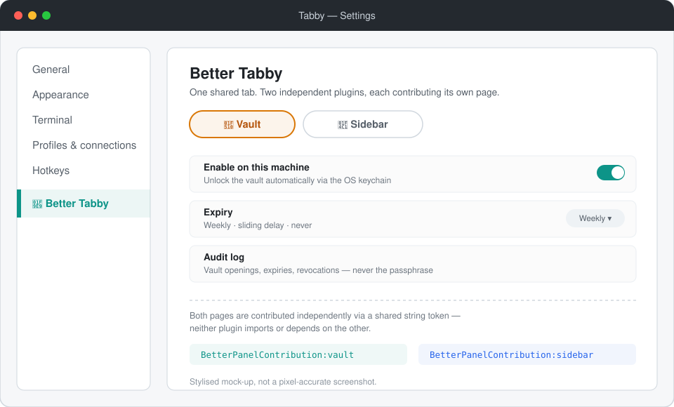

<div align="center">

# 🔐 tabby-better-vault

**Déverrouillage automatique du coffre-fort de [Tabby](https://tabby.sh)** —
le trousseau de votre système se souvient de votre mot de passe maître, Tabby
arrête de le demander.

[English](README.md) · **Français**

[](LICENSE)
[](#-better-tabby-la-famille-de-plugins)
[](docs/ARCHITECTURE.md#security)

</div>

---

Le coffre-fort de Tabby protège vos mots de passe et vos clés privées derrière
un mot de passe maître. Si vous activez en plus le chiffrement de la
configuration, ce mot de passe est réclamé **à chaque démarrage**. Ce plugin
le confie une fois au trousseau de votre système — gestionnaire d'identifiants
Windows, trousseau macOS, ou Secret Service sous Linux — puis répond à votre
place.

> **Note :** ce plugin s'appuie sur une partie non documentée de Tabby ; voir
> [son fonctionnement](docs/ARCHITECTURE.md#how-it-works) (en anglais).

## 🧩 Better Tabby, la famille de plugins



Ce plugin est une moitié de **Better Tabby**, une petite famille de plugins
indépendants qui partagent un seul onglet de réglages plutôt que d'en
disperser trois :

| | Plugin | Ajoute |
|---|---|---|
| 🔐 | **tabby-better-vault** *(ce dépôt)* | Déverrouillage automatique du coffre via le trousseau du système |
| 📁 | **[tabby-better-sidebar](https://github.com/TooMuhtsh/tabby-better-sidebar)** | Favoris épinglés, statut de connexion en direct, glisser-déposer, navigateur SFTP contextuel |

**Aucun des deux plugins n'exige l'autre.** N'installer que celui-ci se
comporte exactement comme si l'autre n'existait pas — son propre onglet de
réglages, rien de partagé. Installer les deux fait élire l'un d'eux pour
héberger un onglet **Better Tabby** unique, chacun continuant à rendre sa
propre page à l'intérieur. Aucune dépendance npm entre les deux dépôts, aucun
code partagé : juste un petit contrat par chaîne de caractères
(`BetterPanelContribution:<id>`) que chaque plugin reconnaît de son côté.
Détail dans [`docs/ARCHITECTURE.md`](docs/ARCHITECTURE.md#the-better-tabby-shared-settings-panel)
(en anglais).

## ✨ Fonctionnalités

- 🔑 **Déverrouillage automatique** via le trousseau du système — gestionnaire
  d'identifiants de Windows (DPAPI), trousseau de macOS, Secret Service sous
  Linux
- 🔒 **Compatible avec la configuration chiffrée**, le cas où le mot de passe
  serait autrement demandé à chaque démarrage
- ⏱️ **Expiration configurable** — créneau hebdomadaire fixe, délai glissant,
  ou jamais
- 💻 **Réglages par machine** — actif sur le poste fixe, inactif sur le
  portable
- 🚫 **Exclusions par profil** — le déverrouillage automatique pour la
  plupart des profils SSH, la fenêtre native de Tabby pour ceux que vous
  excluez ; un groupe sert de raccourci en un clic sur ses membres
- ✋ **Révocation à tout moment** depuis l'onglet de réglages, avec
  notification indiquant où le mot de passe est stocké et comment le révoquer
- 📜 **Journal d'audit** des ouvertures du coffre, des expirations et des
  révocations — ne contenant jamais le mot de passe
- 👀 **Mode observation** — voir ce que ferait le plugin sans le laisser rien
  enregistrer
- 🌍 **Suit la langue de Tabby** — anglais, français, espagnol, allemand
- 🛟 **Repli sûr** — en cas d'anomalie, retour silencieux à la fenêtre native
  de Tabby ; désactivé, il ne touche pas du tout au trousseau
- ✅ **Vérifié sous Windows et Linux**, dont une vérification adversariale
  indépendante sous Linux ayant trouvé et corrigé de vrais défauts.
  **macOS est un support de bonne foi** — même API `safeStorage`, mais non
  mesuré indépendamment.

Le détail technique complet — comment fonctionne réellement l'intégration au
trousseau, ce qu'elle coûte en sécurité, le format du journal d'audit, les
notes par plateforme — vit dans [`docs/ARCHITECTURE.md`](docs/ARCHITECTURE.md)
(en anglais).

## 📦 Installation

Dans Tabby, ouvrir **Réglages → Plugins**, chercher `better-vault` et
l'installer, puis redémarrer complètement Tabby.

<details>
<summary>Directement avec npm</summary>

```bash
# Dans le répertoire de plugins de Tabby : %APPDATA%\tabby\plugins sous
# Windows, ~/.config/tabby/plugins sous macOS/Linux
npm install tabby-better-vault
```

Puis redémarrer complètement Tabby.

</details>

<details>
<summary>Depuis les sources (pour le développement)</summary>

```bash
git clone https://github.com/TooMuhtsh/tabby-better-vault
cd tabby-better-vault
npm install --ignore-scripts
npm run build
```

Puis, Tabby fermé, relier le dossier au répertoire de plugins de Tabby :

```powershell
# Windows — ne pas utiliser la variable TABBY_PLUGINS, elle est cassée
New-Item -ItemType Junction -Path "$env:APPDATA\tabby\plugins\node_modules\tabby-better-vault" -Target "<chemin-vers-ce-dossier>"
```

```bash
# macOS / Linux
ln -s "<chemin-vers-ce-dossier>" ~/.config/tabby/plugins/node_modules/tabby-better-vault
```

Redémarrer complètement Tabby — recharger la fenêtre ne suffit pas.

</details>

## 🚀 Utilisation

Ouvrir **Réglages → Better Vault** (ou **Better Tabby → 🔐 Vault** si
`tabby-better-sidebar` est aussi installé) et activer *Activer sur cette
machine*.

La prochaine fois que Tabby demande le mot de passe maître, le saisir
normalement : celui-là est capturé et confié au trousseau du système. Ensuite,
le coffre s'ouvre tout seul jusqu'à expiration du mot de passe ou révocation.

Un profil doit continuer à demander ? L'onglet **Profils exclus** de la même
page liste vos profils SSH par groupe : un profil exclu retrouve la fenêtre
native de Tabby à chaque connexion, tout le reste continue de se déverrouiller
automatiquement. Exclure un groupe est un raccourci en un clic, appliqué à ses
membres du moment. Ce que cela protège — et ne protège délibérément pas — est
dit sans détour dans
[`docs/ARCHITECTURE.md`](docs/ARCHITECTURE.md#per-profile-exclusions) (en
anglais).

## 🔒 Sécurité, en bref

Ce plugin ne peut pas être plus sûr que le trousseau auquel il délègue, et
stocker le mot de passe — même chiffré — est un vrai compromis, pas un
avantage gratuit. Il refuse de fonctionner sur les backends Linux qui
n'offrent aucune protection réelle, et ne laisse jamais un trousseau
verrouillé bloquer le démarrage de Tabby. Le tableau complet, y compris ce
qu'un attaquant ayant déjà accès à l'exécution de code dans votre session y
gagne, est dans [`docs/ARCHITECTURE.md`](docs/ARCHITECTURE.md#security) (en
anglais).

## Voir aussi

[**tabby-better-sidebar**](https://github.com/TooMuhtsh/tabby-better-sidebar) —
le plugin frère, voir [Better Tabby](#-better-tabby-la-famille-de-plugins)
ci-dessus.

## Crédits

- [Tabby](https://github.com/Eugeny/tabby) par Eugeny — le terminal que ce
  plugin étend
- [tabby-vault-keepassxc](https://github.com/chomoe327/tabby-vault-keepassxc) —
  travaux antérieurs sur le déverrouillage automatique du coffre, et
  confirmation indépendante que patcher `getPassphrase` est la seule voie
  viable
- [ngx-toastr](https://github.com/scttcper/ngx-toastr) et
  [js-yaml](https://github.com/nodeca/js-yaml)

## Licence

MIT — voir [LICENSE](LICENSE).
